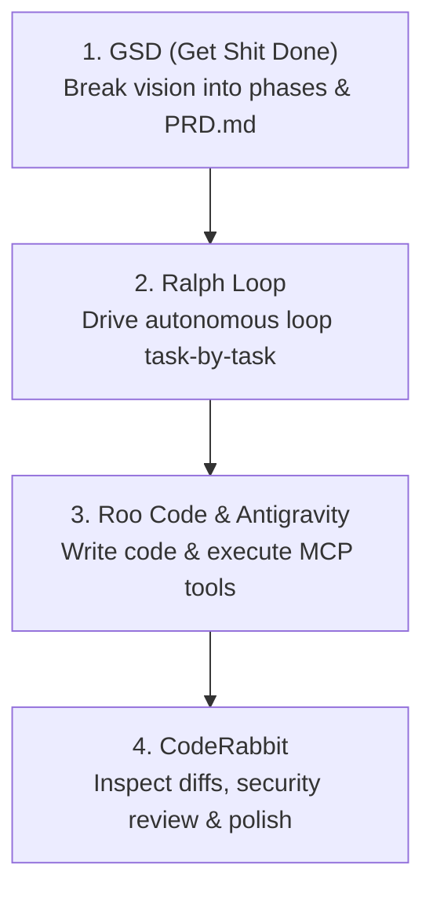
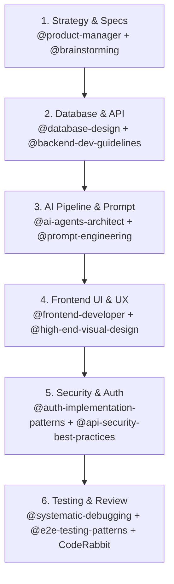

# Antigravity Super-Tools & Skills User Guide
*Complete Setup, Usage Manual & Command Encyclopedia for Antigravity IDE*

---

## 1. Overview of the 4 Core Tools

| Tool | Where it Lives | What it Does | Best Used For |
| :--- | :--- | :--- | :--- |
| **Get Shit Done (GSD)** | Global CLI (`gsd-sdk`) + 67 Agent Skills | Milestone engine & project scaffolding | High-level roadmap, phase breakdown, test generation, and autonomous planning |
| **Roo Code** | Antigravity Left Sidebar (Extension) | Multi-mode autonomous developer agent | Direct file creation, MCP tool execution, Architect/Code mode switching |
| **CodeRabbit** | Antigravity Editor / Source Control (Extension) | Automated inline code review & diff checker | Catching bugs, security audits, clean refactoring before committing code |
| **Ralph Loop** | Antigravity Sidebar & Command Palette (Extension) | Autonomous iteration runner using clean context windows | Running long tasks overnight without AI context decay or hallucinations |

---

## 2. Get Shit Done (GSD) — Complete Guide

### Why isn't GSD a sidebar extension?
GSD is an **Autonomous Project Operating System**:
1. **67 Native Agent Skills:** Installed directly into your Antigravity agent core (`~/.gemini/antigravity/skills`). When you chat with Antigravity, it automatically knows how to execute GSD phases, code reviews, and audits.
2. **Terminal Engine (`gsd-sdk`):** Available in your Antigravity terminal to orchestrate `.planning/` directories, workstreams, and autonomous lifecycles.

### Fixing the "cannot read input file" error
When you run:
```powershell
gsd-sdk init @path/to/prd.md
```
It fails if `@path/to/prd.md` was a syntax placeholder, or because PowerShell treats `@` as splatting.

### How to use GSD CLI correctly:
* **Option A: Initialize with a Text Description (No file needed!):**
  ```powershell
  gsd-sdk init "Build MoodMitra 3D AI emotional companion with voice assistant"
  ```
* **Option B: Initialize from an actual PRD file (Use quotes in PowerShell):**
  ```powershell
  gsd-sdk init "@PRD.md"
  ```
* **Option C: Run Autonomous Execution:**
  ```powershell
  gsd-sdk auto
  ```
* **Option D: Run a Specific Task or Feature Prompt:**
  ```powershell
  gsd-sdk run "Create Supabase database schema for users and mood logs"
  ```

### How to use GSD inside Antigravity AI Chat (Easiest & Free)
You don't need any Claude login in chat! Simply invoke:
* *"Use GSD to plan the next phase of MoodMitra."*
* *"Run a GSD audit milestone on this workspace."*
* *"Use gsd-code-review on my frontend components."*
* *"Run gsd-new-milestone for 3D avatar lip-sync integration."*

---

## 3. Roo Code — The Autonomous Agent Sidebar

### Where to Find It
1. Click the **Roo Code icon** (kangaroo/robot) on the left Activity Bar.
2. Or press `Ctrl + Shift + P` -> type `Roo Code: Focus on View` -> press Enter.

### How to Use It
1. **Modes:**
   * **Architect:** High-level system design and asking questions before writing code.
   * **Code:** Active development, file writing, bug fixes, and testing.
   * **Ask:** Analyzing code and explaining architecture without modifying files.
2. **Configure Provider:** Settings gear -> Add API key (OpenRouter, Gemini, Anthropic, OpenAI, or local Ollama).
3. **Connect MCP Servers:** Directly invoke database queries, scrapers, and subagents.

---

## 4. CodeRabbit — AI Code Review & PR Assistant

### Where to Find It
1. Press `Ctrl + Shift + P` -> search `CodeRabbit`.
2. Open Source Control (`Ctrl + Shift + G`) to review changes before committing.

### How to Use It
1. **Review Changed Files:** Right-click any modified file/folder -> **CodeRabbit: Review Code**.
2. **Review Diffs / Staged Changes:** Click **CodeRabbit: Review Changes** in Source Control.
3. **One-Click Refactors:** Click "Apply Fix" directly on highlighted security or performance issues.

---

## 5. Ralph Loop — Infinite Context Loop Runner

### What Problem Does It Solve?
Solves AI "context decay" during long multi-hour tasks by running autonomous iterations with a clean context window every cycle, reading from `PRD.md` and logging to `progress.txt`.

### How to Set Up Ralph Loop
1. Create `PRD.md` with checklist tasks:
   ```markdown
   # Tasks
   - [ ] Build Gnani.ai TTS WebSocket proxy
   - [ ] Add Three.js VRM model viewport to ChatInterface
   - [ ] Implement in-memory crisis detection interceptor
   ```
2. Create an empty `progress.txt` in project root.
3. Command Palette (`Ctrl + Shift + P`) -> **Ralph Loop: Start Loop**.
4. The agent reads `PRD.md`, checks `progress.txt`, implements the next task, logs progress, clears memory, and loops automatically!

---

## 6. The 4-Tool Synergy Workflow



1. **Plan with GSD:** `gsd-sdk init "Project Name"` or ask in chat *"Use GSD to plan milestone 1"*.
2. **Execute with Ralph Loop & Antigravity:** Ralph Loop iterates through `PRD.md` while Antigravity writes code.
3. **Review with CodeRabbit:** Run CodeRabbit on modified files to ensure zero bugs and clean quality.

---

## 7. Quick Command Cheat Sheet

| Task | Command / Action |
| :--- | :--- |
| **GSD Help** | `gsd-sdk --help` |
| **GSD Init with prompt** | `gsd-sdk init "Your project description"` |
| **GSD Init from file** | `gsd-sdk init "@PRD.md"` |
| **GSD Autonomous run** | `gsd-sdk auto` |
| **GSD Single Task** | `gsd-sdk run "Your task description"` |
| **Open Roo Code** | `Ctrl + Shift + P` -> `Roo Code: Focus on View` |
| **Trigger CodeRabbit** | Right click file -> `CodeRabbit: Review Code` |
| **Trigger Ralph Loop** | `Ctrl + Shift + P` -> `Ralph Loop: Start Loop` |
| **Graphify Knowledge Graph** | `graphify extract . --code-only` or `/graphify .` |

---

## 8. Complete Encyclopedia of Installed Skills (29 Skills)

> **How to invoke any skill in Antigravity chat:**
> Simply type `@skill-name` directly into your Antigravity chat prompt, or mention it naturally.

### 🧱 Category 1: Full-Stack Engineering & Architecture (7 Skills)

| Skill Invocation | Focus | What It Does & When to Use It | Copy-Paste Example Prompt |
| :--- | :--- | :--- | :--- |
| `@senior-fullstack` | System Architecture | Architecting entire projects, tech-stack decisions, cross-layer standards. | *"Use `@senior-fullstack` to architect the full data flow between Gnani.ai, Express proxy, and our Next.js frontend."* |
| `@backend-dev-guidelines` | Backend APIs & Services | Production Express/Next.js API handlers, middleware, validation, clean error handling. | *"Use `@backend-dev-guidelines` to write the streaming audio WebSocket endpoint with proper error handling."* |
| `@database-design` | Database & SQL | PostgreSQL schema, indexing, foreign keys, normalization, and migrations. | *"Use `@database-design` to design the user mood logs table and trusted contact escalation schema."* |
| `@api-patterns` | API Standards | REST/RPC contracts, status codes, pagination, streaming SSE, and payload structures. | *"Use `@api-patterns` to design the paginated mood history and emotion telemetry endpoint."* |
| `@frontend-developer` | React & Web Components | React 19 / Next.js UI components, client state, and connecting frontend to backend APIs. | *"Use `@frontend-developer` to build the reactive chat view with auto-scrolling message bubbles."* |
| `@react-best-practices` | Performance & Re-renders | Eliminating unnecessary re-renders, optimizing hooks (`useMemo`, `useCallback`), and preventing audio memory leaks. | *"Audit and optimize my custom audio recording and Web Audio API analyzer hook using `@react-best-practices`."* |
| `@stripe-integration` | Monetization & Checkout | Checkout sessions, payment webhooks, subscription billing, and server-side verification. | *"Use `@stripe-integration` to implement premium student counseling subscription tiers."* |

---

### 🤖 Category 2: AI Products, LLMs & Autonomous Agents (9 Skills)

| Skill Invocation | Focus | What It Does & When to Use It | Copy-Paste Example Prompt |
| :--- | :--- | :--- | :--- |
| `@ai-agents-architect` | Agent System Design | Multi-agent systems, supervisor loops, memory management, tool calling, and planning. | *"Use `@ai-agents-architect` to design the supervisor agent that routes user queries between grounding coping and emergency crisis escalation."* |
| `@llm-app-patterns` | Production LLMs | Structured JSON outputs, streaming token parsing, error retries, and fallback routing. | *"Use `@llm-app-patterns` to build a streaming prompt pipeline that outputs sentence-level chunks with emotion tags."* |
| `@rag-engineer` | Vector Search & RAG | Retrieval-Augmented Generation, embeddings, document chunking, semantic search, and hybrid retrieval. | *"Use `@rag-engineer` to connect our `mental_health_kb.csv` with in-memory semantic retrieval."* |
| `@prompt-engineering` | Robust Prompts | Production system prompts, few-shot examples, chain-of-thought, and output boundaries. | *"Use `@prompt-engineering` to refine Mahiru's system prompt to enforce platonic elder-sibling support and crisis boundaries."* |
| `@mcp-builder` | MCP Servers | Building Model Context Protocol servers connecting LLMs to databases, tools, or third-party APIs. | *"Use `@mcp-builder` to create an MCP server exposing crisis helpline lookup and trusted contact SMS dispatch."* |
| `@mcp-tool-developer` | MCP Tools & Schemas | Type-safe tool definitions, Zod schemas, error handling, and testing MCP tools. | *"Use `@mcp-tool-developer` to write a tool schema for logging mood scores and triggering avatar emotions."* |
| `@context-window-management` | Token & Context Health | Preventing context decay, trimming token bloat, summarizing chat history, and preserving sharpness. | *"Use `@context-window-management` to design conversation history compression for long study sessions."* |
| `@ai-wrapper-product` | AI Product Market-Fit | Packaging raw AI APIs into high-value products, streaming UX, and masking network latency. | *"Use `@ai-wrapper-product` to design the 0-latency perceived response state while cloud TTS is generating."* |
| `@agent-evaluation` | Benchmarks & Accuracy | Testing agent responses, measuring hallucinations, regression testing, and quality scorecards. | *"Use `@agent-evaluation` to test avatar response accuracy on 50 stressful student query scenarios."* |

---

### 🎨 Category 3: UI, UX & High-End Visual Design (4 Skills)

| Skill Invocation | Focus | What It Does & When to Use It | Copy-Paste Example Prompt |
| :--- | :--- | :--- | :--- |
| `@frontend-design` | UI Component Layout | Clean, responsive modern layouts, proper semantic HTML, and distinctive styling without generic templates. | *"Use `@frontend-design` to layout the split-screen avatar viewport and floating message island."* |
| `@high-end-visual-design` | Agency Visual Polish | Adding visual wow-factor: glassmorphism, micro-animations, tailored palettes, and luxury typography. | *"Use `@high-end-visual-design` to polish the pastel aesthetic and animated glowing blobs in the chat room."* |
| `@ui-ux-pro-max` | UX Flows & Journeys | Frictionless user journeys, mobile responsiveness, accessible touch targets, and form feedback. | *"Use `@ui-ux-pro-max` to design the one-tap panic button and quick-breathing exercise overlay."* |
| `@ui-a11y` | Accessibility & WCAG | Ensuring WCAG 2.1 AA compliance, contrast ratios, screen reader ARIA labels, and keyboard navigation. | *"Audit the entire interactive chat interface with `@ui-a11y` for student accessibility."* |

---

### 🔒 Category 4: Security, Auth & Data Protection (2 Skills)

| Skill Invocation | Focus | What It Does & When to Use It | Copy-Paste Example Prompt |
| :--- | :--- | :--- | :--- |
| `@auth-implementation-patterns` | Authentication & Sessions | Phone OTP, session cookies, JWT verification, refresh tokens, and role-based access control. | *"Use `@auth-implementation-patterns` to implement guest access and student login with demo accounts."* |
| `@api-security-best-practices` | Threat Defense | Input sanitization, rate-limiting, CORS configuration, API key hiding, and Row-Level Security. | *"Audit our Express proxy with `@api-security-best-practices` to secure Gnani.ai credentials from client exposure."* |

---

### 🧪 Category 5: Testing, QA & Debugging (3 Skills)

| Skill Invocation | Focus | What It Does & When to Use It | Copy-Paste Example Prompt |
| :--- | :--- | :--- | :--- |
| `@systematic-debugging` | Root-Cause Analysis | Finding and fixing complex, non-obvious bugs systematically without introducing regressions. | *"Use `@systematic-debugging` to diagnose why the avatar's lip-sync blendshape stutters during rapid audio packets."* |
| `@e2e-testing-patterns` | End-to-End Testing | Writing reliable Playwright / Cypress test suites simulating complete user journeys from login to chat. | *"Use `@e2e-testing-patterns` to write an automated test covering speech input, LLM response, and audio playback."* |
| `@webapp-testing` | Local Web App Verification | Testing local web apps, checking visual regression, verifying button clicks, and running browser checks. | *"Use `@webapp-testing` to verify the chat layout on mobile viewports."* |

---

### 📊 Category 6: Product Strategy & Presentations (4 Skills)

| Skill Invocation | Focus | What It Does & When to Use It | Copy-Paste Example Prompt |
| :--- | :--- | :--- | :--- |
| `@product-manager` | Product Strategy & Metrics | Defining SaaS metrics, unit economics, go-to-market strategy, feature prioritization, and user personas. | *"Use `@product-manager` to formulate the value metrics and judge presentation narrative for MoodMitra."* |
| `@brainstorming` | Creative Problem Solving | Exploring unconventional angles, edge cases, and killer hackathon demo features. | *"Use `@brainstorming` to invent 3 high-impact features that will wow the AIH hackathon judges."* |
| `@pptx-official` | Pitch Decks & Slides | Structuring slide layouts, visual hierarchy, judge-focused narratives, and speaker talking points. | *"Use `@pptx-official` to refine our MoodMitra pitch deck with clear problem-solution slides and competitive tables."* |
| `@pdf-official` | Documents & Reports | Creating professional PDF summaries, project context briefs, and downloadable summaries. | *"Use `@pdf-official` to generate a downloadable project brief for the hackathon submission portal."* |

---

## 9. How to Combine These Skills for Building Full-Stack AI Products



---
*Guide generated and saved for MoodMitra in Antigravity IDE on Windows.*
